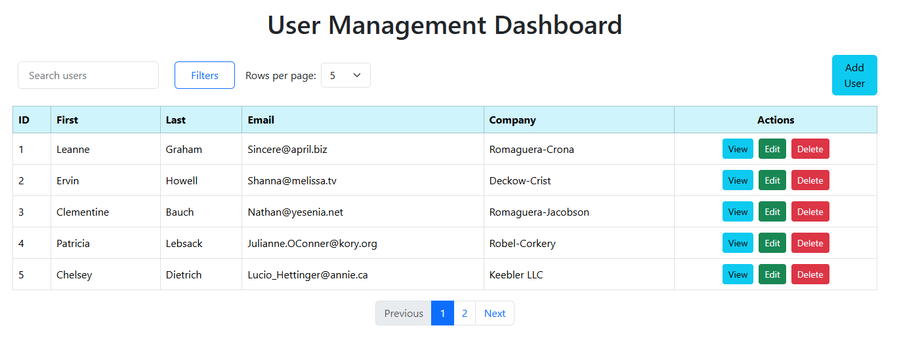

# Users Management Dashboard 

A React-based user management system that allows you to view, add, edit, and delete users with client-side validation, search, sorting, filtering and responsive design.  

Built with **React**, css, **Bootstrap**, and **Axios**, using **JSONPlaceholder** as a mock API.

---

## Features

- Display users in a table with **ID, First Name, Last Name, Email, Company**.  
- **Add/Edit/Delete /View Users** 
- **Client-side validation** (required fields, valid email).  
- **Search and filter** by name, email, company.
- **sort by asc or desc for each column  
- **Pagination** for large datasets.  
- **Responsive design** for all screens   
- **alert message for updating, adding user   
- **Confirmation popups** for deleting users.  

---
## Screenshots


---
### Installation⚙️

1. Clone the repository:

```bash
git clone https://github.com/RubiyaSultana12/Userdashboard
cd Userdashboard
```

2. Install dependencies:

```bash
npm install
```

## Usage📈

To start the development server, run:

```bash
npm start
```

This will start the application in development mode at `http://localhost:3000`.

To build the application for production, run:

```bash
npm run build
```
This will create a production-ready build in the `build` directory.

##API Endpoints
API Base URL: https://jsonplaceholder.typicode.com/users

### Deployment
 vercel:https://userdashboard-zlev.vercel.app/
 github:

##Challenges faced + improvements

Edit/Update Not Reflecting in Table
•	Initially, editing a user in the modal did not update the table immediately.
•	Reason: The table component was not properly updating its state after a successful API update.
•	Fixed by lifting the updated user state back to the parent component and re-rendering the table.
Sorting Users
•	Sorting by multiple fields (ID, First Name, Last Name, Email, Company) needed proper handling.
•	Challenge: Maintaining sort state across re-renders and updating the table dynamically.
•	Fixed by implementing sortConfig in state and sorting the filtered array before rendering.
Pagination & Rows Per Page
•	Initially, the table did not adjust based on “rows per page” selection.
•	Challenge: Slicing the filtered user array correctly and keeping pagination in sync.
•	Fixed by recalculating the visible rows every time itemsPerPage or currentPage changed.

##Improvements Made
Sorting & Filtering
•	Implemented column-wise sorting with arrows (▲▼) for user clarity.
•	Combined search and filter logic with sorting to improve user experience.
Responsive Design
•	Added media queries for 768px screens.
•	Buttons stack vertically on small screens.
•	Table content wraps, preventing horizontal scrolling on mobile devices.
Pagination
•	Users can select rows per page (5, 10, 25, 50, 100).
•	Table updates immediately when rows per page change.
Reusable Components
•	Created UserForm for add/edit operations.
•	Created EditUserModal for modular edit functionality.
•	Table, search, filter, pagination components are reusable.

